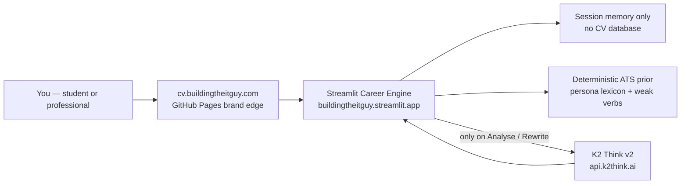

<p align="center">
  
  
  
</p>

<h1 align="center">Building THE IT GUY<br/>Career Engine</h1>

<p align="center">
  <strong>The ATS grader hiring managers wish candidates used before they applied.</strong><br/>
  Paste your CV. Paste the job. Get a match score, the missing language, and bullets that survive the parser.
</p>

<p align="center">
  <a href="https://cv.buildingtheitguy.com"><strong>Analyse your CV now →</strong></a>
  &nbsp;·&nbsp;
  <a href="https://buildingtheitguy.streamlit.app">Direct engine</a>
  &nbsp;·&nbsp;
  <a href="https://github.com/BuildingTHEITGUY/career-engine/stargazers">Star this repo</a>
</p>

---

Your CV is not losing to a better human. It is losing to a keyword gate and a 7-second skim.

Students write *“responsible for password resets.”*  
Professionals write *“involved in ISO discussions.”*  
The job description asked for IAM, least privilege, residual risk, and a CAB.

**Career Engine scores that gap and rewrites the line — for the track you are actually hiring into.**

| If you are… | The engine evaluates… | You leave with… |
|---|---|---|
| A **student**, grad, or switcher | Cloud basics, labs, homelab proof, security fundamentals | A score, missing hard skills, and lab-honest bullets |
| A **professional** in IT, GRC, or delivery | ITIL, COBIT / ISO / NIST, risk metrics, project language | Enterprise terminology, audit-safe phrasing, a 30/60/90 close plan |

No login. No upload to our database. One job. One CV. One decision: apply or fix it first.

---

## Use it in 60 seconds

1. Open **[cv.buildingtheitguy.com](https://cv.buildingtheitguy.com)**.
2. Toggle **Student Track** or **Professional Track**.
3. Paste your CV (or drop a PDF) and the target job description.
4. Run **Gap analysis**, then **Rewrite weak bullets**.
5. Export the markdown report and paste the after-lines into your CV.

Too busy to paste your own? Click **Load sample CV + JD** and watch a duty-list intern get scored against a junior cloud role.

<p align="center">
  <a href="https://cv.buildingtheitguy.com"></a>
</p>

---

## What “good” looks like

This is the bundled student sample — the same one in the live app.

**Before (what ATS sees)**

> Responsible for helping students with password resets and Wi-Fi issues  
> Worked on a ticketing tool and participated in weekly team meetings

**After the engine (what you should submit)**

> A quantified, past-tense bullet that keeps the real tools and adds an outcome — or a `[metric]` you fill in. We do not invent employers, titles, or numbers.

The professional sample does the same to “involved in ISO discussions” — it demands residual risk, RACI, CAB, and SLA language the JD already used.

---

## Architecture

This is a product, not a notebook. The public site is a brand edge. The model never sees your API key. The CV is not written to disk.



| Layer | Role | Trust boundary |
|---|---|---|
| Brand edge | Hosts the iframe. Never reads the CV. | Static files on GitHub Pages |
| Career Engine | Personas, scoring UI, PDF ingest, export | Streamlit Community Cloud |
| Local ATS prior | Keyword overlap if the model is down | Same server, no network call |
| K2 Think v2 | Match narrative, missing terms, rewrites | Sent only after you click. Key lives in host secrets |
| Session | CV, JD, last report | Dies when the tab closes |

**Security by design:** no key in the sidebar, no key in errors or exports, per-session and hourly caps, input size cap. Star the repo; do not paste secrets into issues.

---

## Dual-persona scoring

Hiring is not one rubric. The toggle changes what “fit” means.

**Student Track** rewards labs, GitHub, homelab, IAM / Linux / networking fundamentals. It does not punish you for missing ITIL.

**Professional Track** rewards service outcomes, governance frameworks, KRIs, change control, vendor and SLA language. It does not over-score a homelab.

Both tracks return:

- Match score with a breakdown (hard skills, enterprise terms, persona fit, ATS keywords)
- Missing hard skills and the phrase that would close them
- ATS risk flags (duty verbs, thin CVs, unmirrored JD terms)
- Interview questions the gap will trigger
- A 30 / 60 / 90 close-the-gap plan
- Rewritten bullets you can copy

---

## Privacy, in one paragraph

Your CV stays in the browser session on Streamlit Cloud. It is **not** stored in this GitHub repo, not stored on Hostinger, and not written to a database we control. **K2 Think sees the CV and JD only when you click analysis or rewrite.** Do not paste national IDs, passwords, or CVs you are unwilling to send to Streamlit and MBZUAI’s API.

---

## This repo is a product others can extend

Junior developers: a merged PR here is a line on your CV.  
Professionals: fork it, add a Security or Data track, send it back.

Good first issues live in [`CONTRIBUTING.md`](CONTRIBUTING.md) — DOCX ingest, locale packs, cover-letter draft, LinkedIn About rewrite.

```text
app.py                 Product UI
config.py              Server-side secrets only
utils/personas.py      Student / Professional rubrics
utils/gap_analysis.py  Fit engine
utils/rewriter.py      Achievement rewrite desk
utils/local_ats.py     Deterministic prior
utils/k2_client.py     K2 Think client, retries, redaction
utils/security.py      Quotas and secret stripping
docs/                  Brand edge for cv.buildingtheitguy.com
```

```bash
python -m venv .venv
# Windows: .venv\Scripts\activate
# macOS / Linux: source .venv/bin/activate
pip install -r requirements.txt
python -m pytest
streamlit run app.py
```

Operators who self-host: put `K2_API_KEY` in Streamlit Secrets or a local `.env` that you never commit. Public visitors should never type a key.

---

## Why this should be the repo you star

Most “ATS tools” are a chatbot with a paste box. This one has a **hiring persona**, a **deterministic prior**, a **truthful rewriter**, and a **public URL that does not leak the model key**.

If you are applying this week — [use it](https://cv.buildingtheitguy.com).  
If you are building in public — [star it](https://github.com/BuildingTHEITGUY/career-engine), fork it, and send a PR a hiring manager can click.

Built by [Building THE IT GUY](https://github.com/BuildingTHEITGUY). MIT licensed. Use it. Improve it. Get the job.
